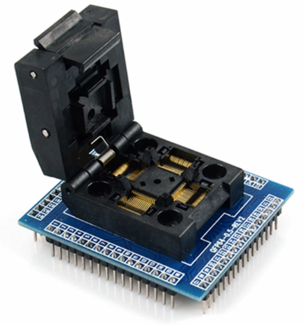

# TM4CTest
Repository for testing TM4C123GH6PMI chips.

This project attempts to develop an integrated test setup for the TM4C123GH6PMI chips. It uses a [LQFP64 socket adapter](https://www.aliexpress.com/item/32995692408.html?spm=a2g0o.productlist.0.0.10b44d30NlEYoA&algo_pvid=e75b03a6-8293-4ada-ae9b-db81fdb2519a&algo_exp_id=e75b03a6-8293-4ada-ae9b-db81fdb2519a-0&pdp_ext_f=%7B%22sku_id%22%3A%2266880087054%22%7D) for fitting in the chip, and a custom PCB for programming and testing it.

The project consists of three parts:
1. A custom PCB design to electrically hook up the TM4C chip.
2. Embedded unit tests that can be flashed into the chip that must demonstrate proper operation of various peripherals.
3. A test script that flashes the chip and returns a collated set of test results.
